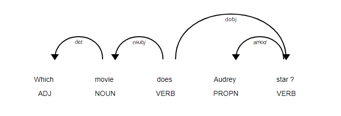

# The Week  2

Let's have a look into this week's goals:
>1. Entity Recognition 
>
>2. Template Generation

## 1. Entity Recognition

### Strategy I
I had planned to deploy the pyspotlight for detecting the DBpedia entities in the question.
However, it seems the connectivity to the server is intermittently unstable, which might result in renting a remote server or it might stumble even after the doing so.
So I jumped to the Strategy 2.

### Strategy II
I rent a server as the transition server.
Then we can freely make the request to the Spotlight:
```python
def annotate(text):
    headers = {
        'Accept': 'application/json',
    }
    data = {
    "text":text ,
    'confidence': '0.35'
    }
    response = requests.post('http://api.dbpedia-spotlight.org/en/annotate', headers=headers, data=data)
    response_json = response.json()
    ...
    # Now it's so easy！
```


## 2. Template Generation

This function depends on the semantic parsing of the question to get the core synthetic structure of the question in order to build a template.

When thinking of Audrey Hepburn, we might ask:

	"Which movie does Audrey Hepburn star ?"

### 2.1 Semantic Parsing 
The question should be parsed to get the synthetic structure by:
	
```bash
[('Which', 'JJ'),
 ('movie', 'NN'),
 ('does', 'VBZ'),
 ('Audrey', 'NNP'),
 ('star', 'VB'),
 ('?', '.')]
```
then we get the semantic tree like:

```json
('Which movie does <A> star ?', ['Person'])
```

> Problem that I think for I :
> 		The semantic parsing is not automated enough that it needs further improvement.

### 2.1 Query Template
Then, based on the work in the last step, we construct the semantic structure for the query template:


And then, with the help of matching the regex of the question, 
```python

class Movie(Particle):
    regex = Question(Pos("DT")) + nouns
    def interpret(self, match):
        name = match.words.tokens
        return IsMovie() + HasName(name)


class Actor(Particle):
    regex = nouns
    def interpret(self, match):
        name = match.words.tokens
        return IsPerson() + HasKeyword(name)


class Director(Particle):
    regex = nouns
    def interpret(self, match):
        name = match.words.tokens
        return IsPerson() + HasKeyword(name)


class ListMoviesQuestion(QuestionTemplate):
    regex = Lemma("list") + (Lemma("movie") | Lemma("film"))
    def interpret(self, match):
        movie = IsMovie()
        name = NameOf(movie)
        return name, "enum"

```
we can get the query output:
```bash
SELECT DISTINCT ?a WHERE {
   ?a rdf:type dbpedia-owl:Film.
   ?x0 dbpprop:starring ?b.
   ?a foaf:name ?x2.
   ?b rdf:type <A>
   ?b rdfs:label "Audrey
   ?b rdfs:label "Audrey
   }
```

> Problem that I think for II:
> 		We can see, the regex needs to be built from the parsing result.
> 		So, when dealing with a totally new question, it risks of disability to immediately figure 
> 		out the new regex for the new questions that the model has never faced before.
> 		How? With what? Based on what?
> 		I must go deeper.
> 		The regex is still not immediately created while facing a new genre of  question, this 
> 		needs  to be focused.

## Summing Up For Week 2

The Templates Generator component is basically built, 
however, still far from perfect.
The next days should delve into the automation about creating the new regexes for the never-processed genres of questions, for which I consider the semantic parsing is the point to break through.

We have certain achievement this week, but still a long way to go.

